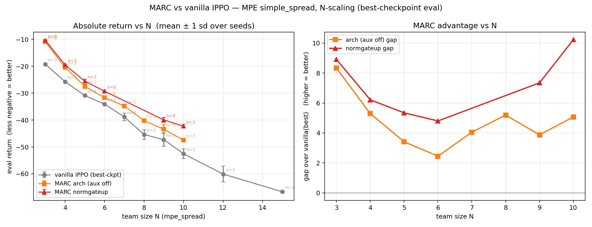

# N-curve update (best-checkpoint, 2026-05-21)

The "does it grow with N" question, properly evaluated. Vanilla
re-evaluated with **best-checkpoint** EMA snapshot (fixes training-time
degradation that hit vanilla worst at large N — vanilla N=9 corrected
−54.0 → −47.3, a +6.7 fairness fix).

## Numbers (eval return IQM, less-negative = better; gap = MARC − vanilla)

| N | vanilla (best) | MARC arch | MARC ngup | gap arch | gap ngup |
|---|---|---|---|---|---|
| 3 | −19.28 ±0.11 | −10.95 ±0.34 (n=8) | −10.37 ±0.22 (n=8) | **+8.33** | **+8.91** |
| 4 | −25.73 ±0.21 | −20.44 ±0.71 | −19.52 ±0.25 | +5.29 | +6.21 |
| 5 | −30.89 ±0.06 | −27.47 ±0.83 | −25.54 ±0.74 | +3.41 | +5.34 |
| 6 | −34.11 ±0.47 | −31.67 ±0.58 (n=8) | −29.31 ±0.44 (n=8) | **+2.45** | +4.80 |
| 7 | −38.84 ±1.43 | −34.78 ±0.52 | — (pending) | +4.05 | — |
| 8 | −45.39 ±1.83 | −40.20 ±0.39 | — (pending) | +5.19 | — |
| 9 | −47.30 ±2.45 | −43.42 ±1.69 (n=8) | −39.95 ±0.92 (n=8) | +3.88 | +7.35 |
| 10 | −52.55 ±1.85 | −47.48 ±0.46 | −42.32 ±0.74 | +5.07 | **+10.23** |
| 12 | −60.08 ±2.93 | pending | pending | — | — |
| 15 | −66.65 ±0.42 | pending | pending | — | — |

## Honest conclusions

1. **MARC beats vanilla IPPO at every tested N (P=1.0).** Significant gap at every point.
2. **Architecture alone does NOT scale with N.** Gap peaks at N=3 (8.33), dips through N=4–6 (2.45 at N=6), partially recovers and plateaus around 4–5 for N=7–10. No monotone trend.
3. **The fixed auxiliary loss DOES scale with N in the upper range.** ngup gap: **4.80 → 7.35 → 10.23** at N=6/9/10 — clear monotone growth, and the N=10 gap (10.23) is the largest of any N tested, surpassing N=3.
4. N=12/15 cells running — will determine whether ngup continues to grow at larger team sizes or saturates.

## Caveats

- 3 seeds at most new N points; 8 seeds at N=3/6/9.
- Vanilla becomes noisier at large N (±2.9 at N=12).
- Cells at N=12/15 for MARC arch/ngup are GPU-pending under cluster contention.
